# Ghar360 App Store & Play Store Screenshot Design Prompts

## Overview

8 portrait screenshots designed as a **narrative story flow** — each screenshot builds on the last, guiding users from curiosity to download. Inspired by the visual language of top-converting apps (Revolut, Airbnb, Notion, Spotify) and built on 2026 design trends: **3D floating mockups**, **luminous glow effects**, **noise-textured dark gradients**, and **glassmorphism**.

---

## Design System Foundation

### App Brand Identity

| Token | Hex | Usage |
|---|---|---|
| Brand Gold (Primary) | `#F5B400` | CTA buttons, accent rule, glow halos |
| Brand Gold Dark | `#E29E00` | Gold shadow tones |
| Brand Gold Light | `#FFCC3D` | Sparkle highlights |
| Accent Orange | `#FF7A28` | Highlight pills, interest chart bar |
| Accent Blue | `#1E88E5` | Map accents, amenities, chat |
| Accent Green | `#2BB673` | Success states, principal chart bar, like |
| Editorial Warm | `#8C6B52` | Warm brown for filled-button text |
| Warm Cream | `#F8F5F0` | Light surfaces, subheadlines |
| Dark Surface | `#171A1F` | Background base layer |
| Dark Surface Alt | `#1F242C` | Background gradient target |
| Neutral 900 | `#121417` | Background gradient start |
| Error Red | `#DC2626` | Favorites heart, pass overlay |
| Success Green | `#16A34A` | Like badge, visit confirmed |

### Typography

- **Headlines**: Inter ExtraBold (800 weight), 46px, white `#FFFFFF`, letter-spacing -0.5px
- **Subheadlines**: Inter Medium (500 weight), 19px, warm cream `#F8F5F0`, letter-spacing 0.2px
- **On-device prices**: Playfair Display Bold, 28-32px
- **On-device labels**: Inter SemiBold (600 weight), 12-16px

### Screenshot Dimensions

| Store | Required Size | Device | Format |
|---|---|---|---|
| Apple App Store | 1290 x 2796 px | iPhone 16 Pro Max (6.9") | PNG/JPEG, no alpha |
| Google Play | 1080 x 1920 px | Phone | JPEG/24-bit PNG, no alpha |

> Design at 1290x2796 for Apple (required). Scale down to 1080x1920 for Google Play. Fill all 8 Play Store slots and up to 10 App Store slots.

### Premium Design Language

**Visual DNA** — a hybrid of three dominant 2026 screenshot styles:

1. **Dark Mode** (Spotify, Discord, Netflix): Deep backgrounds with luminous accent colors that bloom against the dark. Gold `#F5B400` becomes a *light source*, not just a color.
2. **3D Floating Mockup** (Notion, Slack, Revolut): Device frames float in space with soft diffuse drop shadows and ambient screen glow casting color onto the background. 15-20 degree max tilt. Always grounded with shadow.
3. **Bold Typography** (Duolingo, Robinhood, Slack): Headlines are the hero — large, benefit-driven, billboard-style. The UI shown inside the device is *proof*, not the main event.

**Layer Stack** (every screenshot, back to front):

```
┌──────────────────────────────────────┐
│  1. DARK GRADIENT BACKGROUND          │
│     Diagonal: top-left → bottom-right │
│     Never pure #000 — use #0D0D12+    │
├──────────────────────────────────────┤
│  2. NOISE/GRAIN TEXTURE OVERLAY       │
│     2-3% opacity, monochrome noise   │
│     Prevents "empty void" feel        │
├──────────────────────────────────────┤
│  3. AMBIENT GLOW BLOBS               │
│     Soft radial gradients, 8-15%      │
│     Each screenshot has unique accent  │
├──────────────────────────────────────┤
│  4. SCREEN GLOW HALO                 │
│     Color bleed from device screen    │
│     onto background (matches UI)      │
│     Soft box-shadow: 40px blur        │
├──────────────────────────────────────┤
│  5. FLOATING DEVICE FRAME            │
│     iPhone 16 Pro Max, Dynamic Island│
│     15-20px soft drop shadow          │
│     0-3° tilt, shadow direction match │
├──────────────────────────────────────┤
│  6. HEADLINE (top 25% of canvas)     │
│     Inter ExtraBold, white, 46px     │
│     Left-aligned, gold rule beneath   │
├──────────────────────────────────────┤
│  7. SUBHEADLINE (bottom 12% of canvas)│
│     Inter Medium, cream, 19px        │
│     Centered or left-aligned          │
├──────────────────────────────────────┤
│  8. MICRO-DECORATIVE ELEMENTS        │
│     2-4 subtle glyphs: sparkles,     │
│     icons, geometric accents in gold  │
│     Scattered, not symmetric          │
└──────────────────────────────────────┘
```

### Design Rules (All Screenshots)

1. **Backgrounds**: Rich dark gradient `#0D0D12` → `#171A1F` → `#1F242C`. Never pure `#000`. Diagonal flow top-left to bottom-right. Apply noise/grain texture at 2-3% opacity to prevent flat-void feel.
2. **Ambient glow blobs**: Each screenshot has 1-2 soft radial accent-colored glows (8-15% opacity, 200-400px radius) placed strategically to create depth and mood. Not centered — offset for asymmetry.
3. **Screen glow halo**: The device screen casts a subtle color-matched glow onto the background around the device frame (40px gaussian blur, 15-20% opacity). The gold accent color in the app UI bleeds warm light; the map screen bleeds blue light.
4. **Floating device shadow**: iPhone 16 Pro Max frame with 15-20px diffuse drop shadow (black at 25% opacity, 30px vertical offset, 40px blur). Shadow direction matches device tilt.
5. **Headlines**: Maximum 5 words, benefit-driven (outcome not feature), Inter ExtraBold 800, 46px, white `#FFFFFF`, letter-spacing -0.5px. Left-aligned at top 25% of canvas. Thin gold `#F5B400` horizontal rule (56px wide, 1.5px thick) beneath, left-aligned with text.
6. **Subheadlines**: Maximum 7 words, Inter Medium 500, 19px, warm cream `#F8F5F0`, letter-spacing 0.2px. Positioned at bottom 12% of canvas.
7. **Device tilt**: 0-3° max. 0° for financial/trust screens. 2-3° for dynamic/interactive screens. Tilt direction varies for visual rhythm across gallery.
8. **Gold accent**: `#F5B400` must appear in every screenshot — as glow, rule, icon, or UI element. It is the visual thread.
9. **No alpha/transparency** in final PNG exports.
10. **Readability test**: Shrink to 30% and verify headline is scannable in under 1 second.
11. **One benefit per screenshot**. Benefit = what the user *achieves*, not what the button *does*.
12. **Panoramic flow** (optional): Screenshots 1-2 share a continuous background gradient spanning both frames (Airbnb technique).
13. **File size**: Under 8MB per image (Google Play limit).
14. **Micro-decorative elements**: 2-4 tiny gold or accent-colored glyphs per screenshot (sparkles, geometric shapes, icons). Scattered with intention, never symmetric. They add visual richness without clutter.

---

## Screenshot 1: HERO — "Your Dream Home Awaits"

**Narrative Position**: The hook. This screenshot must stop the scroll and sell the dream in under 2 seconds.

| Field | Value |
|---|---|
| Headline | Your Dream Home Awaits |
| Subheadline | Swipe. Like. Move In. |
| Background | Diagonal gradient: `#0D0D12` → `#1F242C`, noise grain 2% |
| Ambient Glow | Gold `#F5B400` radial bloom at bottom-right (12% opacity, 350px radius) |
| Screen Glow | Warm amber halo around device (from property photo light) |
| Device Shadow | 18px soft diffuse, 30px Y-offset, 35px blur, `#000` at 22% |
| Device Tilt | 3° clockwise |
| Decorative | 4 gold sparkle stars (varying sizes 6-14px) near device corners |

### Prompt

A premium portrait app store screenshot (1290x2796px) with a cinematic dark gradient flowing diagonally from near-black (#0D0D12) at top-left to deep charcoal (#1F242C) at bottom-right. A subtle film-grain noise texture overlays the entire background at 2% opacity, giving the dark surface a tactile, non-flat quality. In the bottom-right quadrant, a large soft gold radial glow (#F5B400 at 12% opacity, 350px radius) creates a warm luminous atmosphere — as if golden light is spilling from the phone itself.

An iPhone 16 Pro Max device frame floats at center, tilted 3° clockwise, with a Dynamic Island notch. A soft diffuse drop shadow beneath it (18px, 30px Y-offset, 35px blur, black at 22% opacity) grounds it in space. The device screen casts a warm ambient glow halo onto the surrounding background — the golden tones from the screen content bleed outward (gaussian blur 40px, 15% opacity), making the phone feel like a light source in a dark room.

On the device screen: the ghar360 discover screen in full Bumble-style swipe card mode. A full-bleed property photo of a sunlit luxury Indian apartment interior — warm pendant lighting over a marble kitchen island, floor-to-ceiling windows with greenery outside. At the bottom of the card, a gradient scrim reveals the price "₹1.2 Cr" in Playfair Display Bold 28px white, a translucent "3 BHK" pill badge, a "For Sale" chip in brand gold (#F5B400), and "Koramangala, Bangalore" with a pin icon. The top-left corner of the card shows an "Apartment" type badge in a frosted dark pill. A second card peeks behind at 0.93 scale with 80% opacity, creating a parallax depth stack. At the bottom of the visible card, a frosted "Scroll for more" indicator pill sits centered.

At the top 25% of the canvas, the headline "Your Dream Home Awaits" in Inter ExtraBold 800, 46px, white (#FFFFFF), letter-spacing -0.5px, left-aligned. A thin gold horizontal rule (56px wide, 1.5px thick, #F5B400) sits directly beneath the headline, left-aligned with the text. At the bottom 12% of the canvas, the tagline "Swipe. Like. Move In." in Inter Medium, 19px, warm cream (#F8F5F0).

Four tiny gold sparkle stars are scattered near the device — one near the top-right corner (8px), two near the bottom-left (6px and 10px), one floating above the device (14px, more prominent) — creating a sense of delight and premium energy. The overall mood: aspirational, warm, cinematic — like opening the door to your future home.

### Key UI Elements on Device

- Full-bleed property hero image (luxury apartment interior, warm natural light)
- Bottom gradient scrim with price in Playfair Display + "For Sale" gold chip
- BHK/location pills in translucent frosted containers
- Property type badge (top-left, frosted dark pill)
- Share button (top-right, frosted circle)
- "Scroll for more" frosted indicator pill
- Background card at 0.93 scale / 80% opacity (parallax depth)

---

## Screenshot 2: DISCOVER — "Love at First Swipe"

**Narrative Position**: Core differentiator. The swipe mechanic is the app's soul — this screenshot makes it visceral.

| Field | Value |
|---|---|
| Headline | Love at First Swipe |
| Subheadline | Your next home, one swipe away |
| Background | Diagonal gradient: `#0A0A10` → `#171A1F`, noise grain 2.5% |
| Ambient Glow | Gold `#F5B400` diagonal light streak from bottom-left (10% opacity) + Green `#16A34A` glow at top-left (6% opacity) |
| Screen Glow | Warm gold-green halo from LIKED badge |
| Device Shadow | 20px soft diffuse, 28px Y-offset, 38px blur, `#000` at 24% |
| Device Tilt | 2° clockwise |
| Decorative | 3 sparkles (gold + green mix), swipe arrow glyph in gold outline below device |

### Prompt

A premium portrait app store screenshot (1290x2796px) with a rich dark gradient flowing diagonally from near-black (#0A0A10) at top-left to deep charcoal (#171A1F) at bottom-right. Film-grain noise at 2.5% opacity adds tactile depth. A diagonal gold light streak (#F5B400 at 10% opacity) sweeps upward from the bottom-left corner, and a soft green glow (#16A34A at 6% opacity, 200px radius) pulses in the top-left — the green matching the "LIKED" state visible on screen.

An iPhone 16 Pro Max frame floats at center, tilted 2° clockwise, with a diffuse drop shadow (20px, 28px Y-offset, 38px blur, black at 24%). The screen casts a warm gold-green ambient halo onto the background (gaussian blur 40px, 15% opacity) — the green from the like badge bleeding into the surrounding dark space.

On the device screen: the ghar360 swipe deck mid-interaction. The top property card is being dragged to the right, tilted 8° from the drag momentum. A bold green "LIKED" badge with a white heart icon pulses in the top-left corner of the card (green border #16A34A, 2px, frosted translucent background, heart + "LIKED" text in white Inter Bold). Two more cards stack behind it — the second at 0.93 scale / 75% opacity, the third at 0.86 scale / 55% opacity — creating a deep parallax tunnel. The visible card shows a sleek residential tower exterior at golden hour, with a gradient scrim revealing "₹85 L · 3 BHK · Whitefield". A subtle green tint washes across the dragged card at 12% opacity, reinforcing the "like" action.

At the top 25%: headline "Love at First Swipe" in Inter ExtraBold 800, 46px, white, letter-spacing -0.5px, left-aligned. Gold rule (56px × 1.5px, #F5B400) beneath. At the bottom 12%: "Your next home, one swipe away" in Inter Medium, 19px, cream (#F8F5F0). Below the device, a minimal swipe gesture glyph — a curved right-pointing arrow in gold outline (#F5B400, 1.5px stroke, 28px) — reinforces the interaction. Three sparkles near the device (two gold, one green-tinted, sizes 6-12px) add energy. The mood: playful, magnetic, irresistible.

### Key UI Elements on Device

- Top swipe card mid-drag to the right (8° tilt from gesture)
- "LIKED" badge: green border, white heart, frosted translucent bg
- Green tint wash on dragged card (12% opacity overlay)
- Background card stack: 2 cards at 0.93/75% and 0.86/55%
- Property photo: residential tower at golden hour
- Price + specs overlay at card bottom
- Swipe gesture arrow glyph (outside device, gold outline)

---

## Screenshot 3: PROPERTY DETAILS — "Know Before You Go"

**Narrative Position**: Confidence builder. Shows that every question is answered before the visit.

| Field | Value |
|---|---|
| Headline | Know Before You Go |
| Subheadline | Every detail, before you visit |
| Background | Diagonal gradient: `#0D0D12` → `#1F242C` with warm undertone `#2C2520` at bottom, noise 2% |
| Ambient Glow | Warm amber `#F5B400` at bottom-center (8% opacity, 300px) + Editorial Warm `#8C6B52` subtle at top-right (4%) |
| Screen Glow | Warm amber halo from property image |
| Device Shadow | 16px soft, 25px Y-offset, 32px blur, `#000` at 20% |
| Device Tilt | 0° (editorial, trustworthy, no tilt) |
| Decorative | 1 gold location pin glyph (top-right), 1 thin gold compass line accent (left edge) |

### Prompt

A premium portrait app store screenshot (1290x2796px) with a warm dark gradient flowing diagonally from near-black (#0D0D12) at top-left to deep charcoal (#1F242C) at center, fading to a subtle warm brown undertone (#2C2520) at the bottom-right. Film-grain noise at 2% opacity. A warm amber glow (#F5B400 at 8% opacity, 300px radius) blooms at bottom-center, and a faint editorial-warm glow (#8C6B52 at 4% opacity) sits at top-right — lending an editorial, magazine-spread warmth.

An iPhone 16 Pro Max frame floats at center, upright with zero tilt (conveying trust and editorial precision). A softer shadow (16px, 25px Y-offset, 32px blur, black at 20%) keeps the device grounded but elegant. The screen casts a warm amber halo from the property photo onto the background (gaussian blur 40px, 12% opacity).

On the device screen: the ghar360 property details view, scrolled to the rich information section. At top, a hero property image (modern apartment balcony overlooking Bangalore skyline at dusk). Below, the price "₹85 L" in Playfair Display Bold 30px with an accent orange "For Sale" chip. Title: "Luxury 3BHK in Whitefield". Editorial chips in translucent frosted containers: "Apartment", "₹5,200/sqft". A features grid with gold-tinted icons: 3 beds, 2 baths, 1650 sqft, 2 parking. Below, orange-bordered highlight pills: "Swimming Pool", "Gym", "Clubhouse", "Power Backup". A blue-bordered amenities row: "Lift", "Security", "CCTV". At the bottom, a prominent brand gold "Schedule Visit" CTA button with dark text (#121417).

At the top 25%: headline "Know Before You Go" in Inter ExtraBold 800, 46px, white, left-aligned. Gold rule beneath (56px × 1.5px). At the bottom 12%: "Every detail, before you visit" in Inter Medium, 19px, cream. A small gold location-pin glyph (20px, outline stroke 1.5px, #F5B400) sits near the top-right of the canvas, and a thin vertical gold accent line (1px, 80px tall, 15% opacity) runs along the left edge of the canvas at 30% height — adding editorial sophistication without clutter. The mood: informed, confident, editorial luxury.

### Key UI Elements on Device

- SliverAppBar with property image (apartment balcony, city skyline dusk)
- Circular frosted buttons: back, heart (favorite), share
- Price in Playfair Display + "For Sale" orange chip
- Title + location with pin icon
- Editorial frosted chips: type, price/sqft
- Features grid with gold-tinted icons
- Orange-bordered highlight pills
- Blue-bordered amenity pills
- Gold "Schedule Visit" CTA button

---

## Screenshot 4: MAP EXPLORATION — "Explore Your Way"

**Narrative Position**: Spatial intelligence. The map empowers users with location context — neighborhood, proximity, possibilities.

| Field | Value |
|---|---|
| Headline | Explore Your Way |
| Subheadline | Pin your perfect neighborhood |
| Background | Diagonal gradient: `#080E1A` → `#121417` → `#171A1F`, noise 2.5% |
| Ambient Glow | Blue `#1E88E5` radial at top-right (8% opacity, 250px) + Gold `#F5B400` soft at bottom-left (5%) |
| Screen Glow | Cool blue halo from map interface |
| Device Shadow | 18px soft, 28px Y-offset, 36px blur, `#000` at 22% |
| Device Tilt | 1° clockwise |
| Decorative | 1 gold compass-rose glyph (top-right), 2 blue-tinted sparkle dots |

### Prompt

A premium portrait app store screenshot (1290x2796px) with a deep dark gradient flowing from midnight navy (#080E1A) at top to charcoal (#121417) at center to dark surface (#171A1F) at bottom-right. Film-grain noise at 2.5% opacity. A cool blue glow (#1E88E5 at 8% opacity, 250px radius) blooms at the top-right, and a subtle gold warmth (#F5B400 at 5% opacity, 200px radius) at bottom-left — the cool-to-warm diagonal creating visual tension and depth.

An iPhone 16 Pro Max frame floats at center, tilted 1° clockwise, with a diffuse shadow (18px, 28px Y-offset, 36px blur, black at 22%). The screen casts a cool blue halo onto the background (gaussian blur 40px, 13% opacity) — the map's blue tones bleeding into the surrounding dark space like city light pollution.

On the device screen: the ghar360 explore map view. An OpenStreetMap with a subtle dark-mode tint shows the Bangalore area. Gold (#F5B400) property marker chips dot the map showing prices — "₹1.2 Cr", "₹65 L", "₹45 L" — some clustered, some standalone. A large semi-transparent gold circle shows the search radius. On the right side, zoom controls (+/-) in warm cream (#F8F5F0) containers with dark icons. A gold-highlighted "My Location" button. In the top-left, a frosted info panel: "24 properties · Koramangala". At the bottom edge, a collapsible horizontal property list panel partially expanded, showing 2 property card thumbnails with prices and drag-handle indicator.

At the top 25%: headline "Explore Your Way" in Inter ExtraBold 800, 46px, white, left-aligned. Gold rule (56px × 1.5px) beneath. At the bottom 12%: "Pin your perfect neighborhood" in Inter Medium, 19px, cream. A delicate gold compass-rose glyph (24px, 1px outline stroke, #F5B400) sits near the top-right corner of the canvas. Two tiny blue-tinted sparkle dots (5px, 7px) float near the top-left. The mood: exploratory, spatial, empowered.

### Key UI Elements on Device

- OpenStreetMap with dark-mode tint
- Gold property marker chips with prices
- Gold semi-transparent search radius circle
- Zoom +/- controls in warm cream containers
- Gold "My Location" button
- Frosted info panel: count + area name
- Horizontal property list panel (partially expanded) with drag handle

---

## Screenshot 5: 360° VIRTUAL TOUR — "Step Inside Without Leaving"

**Narrative Position**: The wow factor. This is the single most impressive feature — immersive, cinematic, futuristic.

| Field | Value |
|---|---|
| Headline | Step Inside Without Leaving |
| Subheadline | 360° tours from your couch |
| Background | Pure dark: `#080808` → `#0D0D12` → `#121417`, noise 3% (slightly heavier for cinematic feel) |
| Ambient Glow | Central gold radiance `#F5B400` at 14% opacity, 400px radius (the device is the spotlight) |
| Screen Glow | Strong warm gold-white halo (the panorama is the light source) |
| Device Shadow | 24px very soft, 35px Y-offset, 50px blur, `#000` at 28% (dramatic, cinematic) |
| Device Tilt | 0° (immersive, the content speaks — no tilt needed) |
| Decorative | 3 gold sparkle stars (8-16px), 1 subtle 360° rotation icon next to headline |

### Prompt

A cinematic portrait app store screenshot (1290x2796px) with a dramatically dark gradient from near-black (#080808) at top to deep charcoal (#121417) at bottom. A heavier film-grain noise at 3% opacity adds a filmic, theatrical texture — like a dark movie theater before the projector starts. A powerful central gold radiance (#F5B400 at 14% opacity, 400px radius) emanates from the center of the canvas — the device is the spotlight, and the light pours outward.

An iPhone 16 Pro Max frame floats at center, upright with zero tilt. A dramatic soft shadow (24px, 35px Y-offset, 50px blur, black at 28%) creates a strong cinematic grounding. The screen casts an intense warm gold-white halo onto the background (gaussian blur 50px, 20% opacity) — the 360° panorama interior is so luminous it illuminates the entire surrounding space, like a window into another world.

On the device screen: a full-bleed immersive 360° panorama of a luxurious living room — floor-to-ceiling windows flooding warm afternoon light across modern furniture, a marble coffee table, indoor plants, and a view of greenery outside. The panorama fills the device edge-to-edge with no visible app chrome except a subtle frosted fullscreen button in the corner and a thin gyroscope rotation indicator (a small circle with an arrow). The experience is like looking through a portal.

At the top 25%: headline "Step Inside Without Leaving" in Inter ExtraBold 800, 46px, white, left-aligned. A small 360° rotation icon in gold (#F5B400, 18px, outline) sits beside the headline. Gold rule (56px × 1.5px) beneath. At the bottom 12%: "360° tours from your couch" in Inter Medium, 19px, cream. Three gold sparkle stars float around the device — one large (16px) above-right, two smaller (8px, 10px) below-left — like light catching dust particles in a sunbeam. The mood: immersive, cinematic, magical — like stepping through a doorway.

### Key UI Elements on Device

- Full-bleed 360° panorama (luxury living room, warm natural light)
- Gyroscope rotation indicator (subtle circle)
- Fullscreen button (frosted, minimal)
- The panorama IS the visual — no app chrome visible except absolute minimum

---

## Screenshot 6: LIKES & COLLECTION — "Never Lose a Home You Love"

**Narrative Position**: Emotional anchor. Triggers FOMO — the fear of losing something you already found.

| Field | Value |
|---|---|
| Headline | Never Lose a Home You Love |
| Subheadline | Your shortlist, always at hand |
| Background | Diagonal gradient: `#0D0D12` → `#1E1A16` (warm-brown dark), noise 2% |
| Ambient Glow | Soft rose-red `#DC2626` at bottom-right (6% opacity, 250px) + Gold `#F5B400` at top-left (4%) |
| Screen Glow | Warm red-gold halo from hearts and property images |
| Device Shadow | 16px soft, 25px Y-offset, 32px blur, `#000` at 20% |
| Device Tilt | 1° counter-clockwise (slight opposing tilt for gallery rhythm) |
| Decorative | 1 small red heart glyph next to headline, 2 gold sparkle dots |

### Prompt

A premium portrait app store screenshot (1290x2796px) with a warm dark gradient from near-black (#0D0D12) at top-left to warm-brown dark (#1E1A16) at bottom-right. Film-grain noise at 2% opacity. A soft rose-red glow (#DC2626 at 6% opacity, 250px radius) blooms at the bottom-right, and a faint gold warmth (#F5B400 at 4% opacity, 180px radius) at top-left — the red-gold combination evoking warmth, desire, and the emotional pull of finding a home.

An iPhone 16 Pro Max frame floats at center, tilted 1° counter-clockwise, with a soft shadow (16px, 25px Y-offset, 32px blur, black at 20%). The screen casts a warm red-gold halo onto the background (gaussian blur 40px, 14% opacity) — the hearts and property images bleeding warm light.

On the device screen: the ghar360 likes collection. At top, a segmented control with "Liked" selected (with a badge count "12" in a gold circle) and "Passed" tab. Below, a beautiful masonry/staggered grid — 2 columns with variable-height property cards. Some cards show tall villa exteriors with pools, others show compact apartment interiors. Each card has a filled red heart (#DC2626) in the corner, a bold price ("₹1.2 Cr", "₹45 L", "₹85 L"), BHK info, and location text. The staggered heights create a Pinterest-like visual rhythm that feels rich and curated, not uniform and boring.

At the top 25%: headline "Never Lose a Home You Love" in Inter ExtraBold 800, 46px, white, left-aligned. A small filled red heart glyph (#DC2626, 16px) sits between the headline and the gold rule (56px × 1.5px). At the bottom 12%: "Your shortlist, always at hand" in Inter Medium, 19px, cream. Two tiny gold sparkle dots (6px, 8px) float near the top-right. The mood: aspirational, emotional, protective — your curated collection of dream homes.

### Key UI Elements on Device

- Segmented control: "Liked" (selected, gold badge "12") | "Passed"
- Masonry/staggered grid (2 columns, variable heights)
- Property cards: thumbnail, filled red heart, bold price, BHK, location
- Diverse property types: villas, apartments, plots
- "For Sale" / "For Rent" badges on some cards
- Search bar + filter button at top

---

## Screenshot 7: TOOLS & CALCULATORS — "Crunch the Numbers"

**Narrative Position**: Rational value. The tools satisfy the analytical mind — for buyers who do their homework.

| Field | Value |
|---|---|
| Headline | Crunch the Numbers |
| Subheadline | EMI, area converter & more |
| Background | Diagonal gradient: `#0D0D12` → `#1A1F28` (cool slate), noise 2% |
| Ambient Glow | Green `#2BB673` at bottom-left (6% opacity, 200px) + Orange `#FF7A28` at top-right (5% opacity, 180px) |
| Screen Glow | Dual green-orange halo from chart bars |
| Device Shadow | 14px, 22px Y-offset, 30px blur, `#000` at 18% (lighter shadow — financial clarity) |
| Device Tilt | 0° (financial, precise, no tilt) |
| Decorative | 1 gold calculator glyph, 4 tiny gold tool icons in a row at bottom |

### Prompt

A premium portrait app store screenshot (1290x2796px) with a cool dark gradient from near-black (#0D0D12) at top-left to dark slate (#1A1F28) at bottom-right. Film-grain noise at 2% opacity. A green accent glow (#2BB673 at 6% opacity, 200px radius) blooms at the bottom-left, and an orange glow (#FF7A28 at 5% opacity, 180px radius) at the top-right — the green and orange directly matching the principal/interest chart colors, creating a visual echo between the ambient atmosphere and the on-screen data.

An iPhone 16 Pro Max frame floats at center, upright with zero tilt (conveying financial precision and trust). A clean shadow (14px, 22px Y-offset, 30px blur, black at 18%) — intentionally lighter than other screenshots to match the financial, clear-minded tone. The screen casts a dual green-orange halo (gaussian blur 40px, 12% opacity) — the chart colors bleeding ambient light.

On the device screen: the ghar360 EMI calculator showing a completed calculation. Input fields display: "₹50,00,000" (loan amount, with ₹ prefix), "8.5%" (interest rate, with % suffix), "20 years" (tenure, with years selected in a segmented button). A bold "Calculate" button in brand gold (#F5B400). Below: the results card — "Monthly EMI" label, then a large dramatic gold "₹43,391" (32px bold, #F5B400 — the hero number). A horizontal breakdown bar: green (#2BB673, 62%) for principal and orange (#FF7A28, 38%) for interest, with percentage labels. Below: "Total Interest" and "Total Payment" in a clean row layout.

At the top 25%: headline "Crunch the Numbers" in Inter ExtraBold 800, 46px, white, left-aligned. A small gold calculator glyph (20px, outline stroke 1.5px, #F5B400) sits to the right of the headline. Gold rule (56px × 1.5px) beneath. At the bottom 12%: "EMI, area converter & more" in Inter Medium, 19px, cream. Below the subheadline, a horizontal row of 4 tiny gold-outlined tool icons (12px each, 1px stroke, #F5B400): square_foot, account_balance, calculate, checklist — representing the full tools suite. The mood: smart, precise, in-control.

### Key UI Elements on Device

- App bar: "EMI Calculator" + refresh icon
- Loan amount field (₹50,00,000) with ₹ prefix
- Interest rate field (8.5%) with % suffix
- Tenure field (20 years) with segmented years/months toggle
- Gold "Calculate" filled button
- Results: "Monthly EMI" → large gold "₹43,391"
- Horizontal bar chart: green principal (62%) + orange interest (38%)
- Legend + total rows

---

## Screenshot 8: VISITS & ASSISTANT — "Someone's Got Your Back"

**Narrative Position**: Trust closer. The human element — real people, real support. This is the emotional safety net that tips fence-sitters into downloading.

| Field | Value |
|---|---|
| Headline | Someone's Got Your Back |
| Subheadline | Your real estate partner, always |
| Background | Diagonal gradient: `#0D0D12` → `#1E1A16` (warm dark), noise 2% |
| Ambient Glow | Blue `#1E88E5` at upper-left (6% opacity, 220px) + Gold `#F5B400` at lower-right (8% opacity, 280px) |
| Screen Glow | Warm blue-gold halo from chat bubbles and agent card |
| Device Shadow | 18px, 28px Y-offset, 36px blur, `#000` at 22% |
| Device Tilt | 1° clockwise |
| Decorative | 1 gold chat-bubble glyph, 1 gold calendar glyph, 2 sparkle dots (blue + gold) |

### Prompt

A premium portrait app store screenshot (1290x2796px) with a warm dark gradient from near-black (#0D0D12) at top-left to warm-dark (#1E1A16) at bottom-right. Film-grain noise at 2% opacity. A calm blue glow (#1E88E5 at 6% opacity, 220px radius) at the upper-left, and a warm gold glow (#F5B400 at 8% opacity, 280px radius) at the lower-right — blue for support/trust, gold for brand warmth, creating a dual-tone atmosphere that mirrors the two features shown.

An iPhone 16 Pro Max frame floats at center, tilted 1° clockwise, with a balanced shadow (18px, 28px Y-offset, 36px blur, black at 22%). The screen casts a warm blue-gold halo (gaussian blur 40px, 14% opacity).

On the device screen: a split composite view. The upper 55% shows the visits screen — a segmented control: "Scheduled Visits" (selected, badge "3" in gold) | "Past Visits". Below it, an agent relationship manager card with a warm professional photo, name "Rahul Sharma", title "Relationship Manager", and two action buttons: a phone icon (call) and WhatsApp icon in green (#2BB673). Below, 2 upcoming visit cards showing property thumbnails, property titles, date/time ("15/06/2026 · 11:00 AM"), and subtle "Reschedule" / "Cancel" text buttons. The lower 45% shows the AI assistant chat — a user message bubble ("right-aligned, blue-tinted) asking "Any 3BHK under ₹80L in Whitefield?", an assistant response bubble (left-aligned, with a subtle gold accent border) recommending a property with a thumbnail, and suggested prompt chips at the bottom: "Budget homes near me", "Compare 2 properties", "Latest listings".

At the top 25%: headline "Someone's Got Your Back" in Inter ExtraBold 800, 46px, white, left-aligned. Gold rule (56px × 1.5px) beneath. At the bottom 12%: "Your real estate partner, always" in Inter Medium, 19px, cream. A small gold chat-bubble glyph (16px, outline) sits near the top-left, and a small gold calendar glyph (16px, outline) near the bottom-right of the canvas — reinforcing the two features. Two sparkle dots (one blue 6px, one gold 8px) near the device. The mood: supported, guided, safe — you're never alone in this journey.

### Key UI Elements on Device

**Upper half (Visits):**
- Segmented control: "Scheduled Visits" (badge "3") | "Past Visits"
- Agent card: photo, name, role, call button, WhatsApp button
- Visit cards: property thumbnail, title, date/time, reschedule/cancel

**Lower half (Assistant):**
- Chat bubbles: user (right-aligned, blue-tinted) and assistant (left-aligned, gold accent)
- Property recommendation card inside assistant bubble
- Suggested prompt chips
- Chat input bar with send button

---

## Narrative Flow Diagram

```mermaid
flowchart LR
    H["1. HERO\nYour Dream Home\nAwaits"] --> D["2. DISCOVER\nLove at First\nSwipe"]
    D --> P["3. DETAILS\nKnow Before\nYou Go"]
    P --> M["4. MAP\nExplore\nYour Way"]
    M --> T["5. TOUR\nStep Inside\nWithout Leaving"]
    T --> L["6. LIKES\nNever Lose a\nHome You Love"]
    L --> C["7. TOOLS\nCrunch the\nNumbers"]
    C --> V["8. VISITS\nSomeone's Got\nYour Back"]

    style H fill:#F5B400,stroke:#E29E00,color:#121417
    style D fill:#121417,stroke:#F5B400,color:#F8F5F0
    style P fill:#121417,stroke:#8C6B52,color:#F8F5F0
    style M fill:#121417,stroke:#1E88E5,color:#F8F5F0
    style T fill:#121417,stroke:#F5B400,color:#F8F5F0
    style L fill:#121417,stroke:#DC2626,color:#F8F5F0
    style C fill:#121417,stroke:#2BB673,color:#F8F5F0
    style V fill:#121417,stroke:#1E88E5,color:#F8F5F0
```



**Story Arc**: DREAM (1) → PLAY (2) → CONFIDENCE (3) → EXPLORE (4) → WOW (5) → EMOTION (6) → LOGIC (7) → TRUST (8)

---

## Optional: Additional Screenshots (Apple App Store — up to 10)

### Screenshot 9: PROFILE — "Make It Yours"

**Headline**: Make It Yours
**Subheadline**: Preferences that match you

**Prompt**: A premium portrait app store screenshot (1290x2796px) with a dark gradient (#0D0D12 → #1F242C), film-grain noise 2%, a subtle gold glow at bottom-center (8% opacity, 250px). iPhone 16 Pro Max frame, 0° tilt, floating with soft shadow. Device screen shows the ghar360 profile: a large user avatar circle (initial "A" on gold-tinted background), name "Arjun Mehta" in bold, email/phone below in muted text. Menu sections with yellow-circle icon backgrounds — "Account" (heart icon: My Preferences, calculator icon: Tools & Calculators), "Support" (shield: Privacy & Security, help: Help, info: About). A subtle gold "Sign Out" text at bottom. Headline "Make It Yours" Inter ExtraBold 800 46px white, gold rule, left-aligned at top 25%. Subheadline "Preferences that match you" Inter Medium 19px cream at bottom 12%. Screen glow: warm gold halo. Decorative: 1 gold person glyph (top-right). Mood: personal, owned, tailored.

### Screenshot 10: ONBOARDING — "Start in Seconds"

**Headline**: Start in Seconds
**Subheadline**: Phone number. That's it.

**Prompt**: A premium portrait app store screenshot (1290x2796px) with a dark atmospheric background — a blurred luxury real estate exterior photo (modern apartment complex at twilight) overlaid with a strong dark scrim (#0D0D12 at 55% opacity) to maintain the dark premium aesthetic. Film-grain noise at 2.5%. A soft gold glow blooms at center (10% opacity, 300px radius). iPhone 16 Pro Max frame, 2° clockwise tilt, floating. Device screen shows the ghar360 phone entry/auth screen: the "ghar360" wordmark in white at top, title "Enter Your Phone Number" in white, a frosted glass card (backdrop-blur, white border at 18% opacity) containing a phone input with India flag 🇮🇳 +91 prefix showing "9876543210", a gold "Continue" filled button (#F5B400, dark text), and frosted trust chips at bottom: "Verified" (green dot), "Transparent" (blue dot), "24/7 Support" (gold dot). The frosted glass effect over the dark atmospheric background creates a stunning glassmorphism composition. Headline "Start in Seconds" Inter ExtraBold 800 46px white, gold rule, top 25%. Subheadline "Phone number. That's it." Inter Medium 19px cream, bottom 12%. Screen glow: warm gold halo from Continue button. Decorative: 2 gold sparkle dots. Mood: inviting, effortless, premium-first-impression.

---

## Production Checklist

Before exporting final images:

- [ ] All screenshots at 1290x2796px (Apple) and 1080x1920px (Google Play)
- [ ] No alpha channels in PNG exports
- [ ] Headlines readable at thumbnail size (30% zoom test)
- [ ] First screenshot sells the dream (benefit, not feature)
- [ ] Each screenshot tells one clear benefit story
- [ ] Brand Gold (#F5B400) present in every frame
- [ ] Device frame: iPhone 16 Pro Max with Dynamic Island
- [ ] All 8 Google Play slots + all 10 Apple slots filled
- [ ] No placeholder content — real Indian locations, ₹ pricing, Indian names
- [ ] Headlines: 3-5 words, benefit-driven, action verbs
- [ ] Subheadlines: under 7 words
- [ ] Film-grain noise applied to every background
- [ ] Ambient glow blobs present on every screenshot
- [ ] Screen glow halo casting from device onto background
- [ ] Device shadow: soft, diffuse, direction matches tilt
- [ ] Micro-decorative elements: 2-4 per screenshot, scattered not symmetric
- [ ] Dark gradients flow continuously between adjacent screenshots
- [ ] File size under 8MB per image
- [ ] Test at actual App Store/Play Store thumbnail size on device

## Recommended Design Tools

| Tool | Best For |
|---|---|
| **Figma** | Full control, device frames, pixel-perfect exports, shadow/glow tuning |
| **AppScreens.com** | Template-based editor with device frames for both stores |
| **TheAppLaunchpad.com** | Drag-and-drop builder with 3D mockup styles |
| **AppScreenshotStudio** | AI-powered generation, pick a style from top apps |
| **AppScreenMagic.com** | AI restyling — upload raw screenshots, pick dark-mode/3D-mockup style |
| **MockUPhone.com** | Free device frame wrapping for existing captures |
